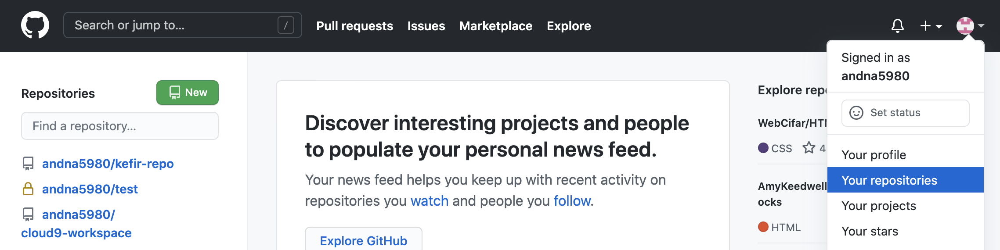
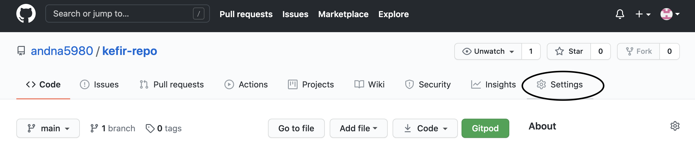
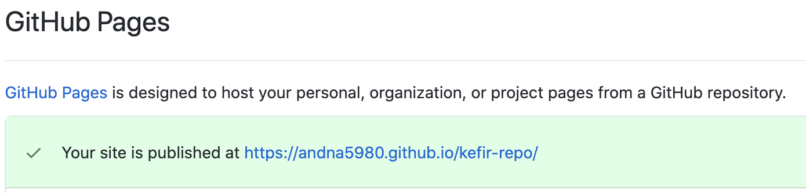

<h1 align="center">Kefir Website</h1>

[View the live project here.](https://andna5980.github.io/kefir-repo/index.html)

This is Kefir Website. This website has been designed to be responsibe and accesible from different devices in order to make the navigation user experience easy and enjoyable.

<h2 align="center"></h2>

## User Experience (UX)

-   ### User stories

    1. As a first-time visitor, I want to rapidly understand the purpose of the website and how I can benefit from the product and service provided.

    2. As a first-time visitor I want to be able to navigate through the page in a ease and clear way.

    3. As a first-time visitor I want to find on the site all the social media links, so I can check if the site is trustworthy. Also, I would like see the real testimonials that help me understand the benefits of the product.

    4. As a returning visitor, I would like to find easily the contact area, so I can use it in case of questions or doubts.
    5. As a retuning visitor I would like to see new content that can inspire me to create my own recipes 
    6. As a returning visitor, I would like to find ways to connect with people who will have the same Kefir interest. 
    7. As a frequent user I want to be constantly updated about new recipes or products derivatives. 

-  ### Design
    -   #### Colour Scheme
        -   The main colours used in the site are, a very dark saturated blue, white and a color called sugar cane. We tried to used a reduce  and  simple selection of colours.
    -   #### Typography
        -   The two main fonts used in the whole website are Caveat Brush and Arial, using Helvetica as the fallback font. We choose Caveat Brush for all the titles as it has some similar features to letters from the region where Kefir comes from. Also Arial for the rest of text as is a very clean font easy to read.  
    -   #### Imagery
        -   All the imagery we used has the main purpose of create a pleasant experience to the eye. The hero image and the cover text got the simple function of showing the minimal size of the product but the powerful properties  it also got. The animation its designed to catch user attention. The design 
        has been done to create a clean, simple and minimalistic experience to the user for an easy interaction with the site and its content.
        
*   ### Wireframes

    -   Home Page Wireframe - [View](https://github.com/andna5980/kefir-repo/blob/main/assets/wireframes/homepage.pdf)

    -   Mobile Wireframe - [View](https://github.com/andna5980/kefir-repo/blob/main/assets/wireframes/Mobile.pdf)

    -   Contact Us Page Wireframe - [View](https://github.com/andna5980/kefir-repo/blob/main/assets/wireframes/contactus.pdf)

## Features

-   Responsive on all device sizes

-   Interactive elements

## Technologies Used

### Languages Used

-   [HTML5](https://en.wikipedia.org/wiki/HTML5)
-   [CSS3](https://en.wikipedia.org/wiki/Cascading_Style_Sheets)

### Frameworks, Libraries & Programs Used

1. [Bootstrap 4.4.1:](https://getbootstrap.com/docs/4.4/getting-started/introduction/)
    - Bootstrap was used to assist with the responsiveness and styling of the website.
1. [Hover.css:](https://ianlunn.github.io/Hover/)
    - Hover.css was used on the Social Media icons in the footer to add the float transition while being hovered over.
1. [Google Fonts:](https://fonts.google.com/)
    - Google fonts were used to import the 'Caveat Brush' font into the style.css file.
1. [Font Awesome:](https://fontawesome.com/)
    - Font Awesome was used on all pages to add icons mainly the footer.
1. [Visual Studio Code:](https://code.visualstudio.com/)
    - Visual Studio Code is the main editor used to write huge part of the code, but also to commit and push to Github.    
1. [jQuery:](https://jquery.com/)
    - jQuery came with Bootstrap to make the navbar responsive.
1. [Git](https://git-scm.com/)
    - Git was used for version control by utilizing the Gitpod terminal to commit to Git and Push to GitHub.
1. [GitHub:](https://github.com/)
    - GitHub is used to store the projects code after being pushed from Git.
1. [Balsamiq:](https://balsamiq.com/)
    - Balsamiq was used to create the wireframes as part of the design process.
1. [Tinypng:](https://tinypng.com/)
    - Tinypng was used to compress all the images used in the website.

## Testing

The W3C Markup Validator and W3C CSS Validator Services were used to validate every page of the project to ensure there were no syntax errors in the project.

-   [W3C Markup Validator](https://jigsaw.w3.org/css-validator/#validate_by_input) - [Results](https://github.com/andna5980/kefir-repo/blob/main/assets/readme/w3c%20Markup%20Validation%20Service%20results%20.png)
-   [W3C CSS Validator](https://jigsaw.w3.org/css-validator/#validate_by_input) - [Results](https://github.com/andna5980/kefir-repo/blob/main/assets/readme/w3c%20css%20validator-results.png)

### Testing User Stories from User Experience (UX) Section

-   #### Visitor Goals

    1. As a first-time visitor, I want to rapidly understand the purpose of the website and how I can benefit from the product and service provided.
    
        1. User will be welcome with a Kefir image picture with an animation, with an easy navigation bar that will lead to the rest of the pages.
        2. The main welcome area will show the user the main purpose of the page.
        3. User will have the option to scroll down to see the rest of the main page or navigate to any of the other pages.     
    
    2. As a first-time visitor I want to be able to navigate through the page in a ease and clear way.
        
        1. The website has an easy to understand area, the navigation bar clearly state the two other pages purpose. 
        2. The second page link takes the user to the recipe area also clearly stated.
        3. Contact page is an area where users will be abe to provide their information in order to join the kefir community.   

    3. As a first-time visitor I want to find on the site all the social media links, so I can check if the site is trustworthy. Also, I would like see the real          testimonials that help me understand the benefits of the product.
    
        1. Users will easily find the social media links in the footer area. These links are represented by medium size icons which will help user to identify them         with the social media.   

    4. As a returning visitor, I would like to find easily the contact area, so I can use it in case of questions or doubts.
        
        1. User will easily find the contact area in the navigation bar. 
        2. Contact page will give users the posibility to be contacted for different reasons like general information, recipes or join the community.

    6. As a retuning visitor I would like to see new content that can inspire me to create my own recipes.
    
        1. Users will be able to see recipes examples in our recipes area. This area will help the user to awake their creativity.  
        2. Users will see new recipes content loaded to the recipes page on a regular basis. 
     
    8. As a returning visitor, I would like to find ways to connect with people who will have the same Kefir interest. 
    
        1. Users will have the option to join the Kefir community using the contact us form located in the contact page. 
    
    10. As a frequent user I want to be constantly updated about new recipes or products derivatives.

        1. Users will be able to be update with new recipes, benefits and new kefir products when they join the kefir community.

### Further Testing

-   Kefir website has been tested on Safari browsers, Google Chrome,Firefox browser, Microsoft Edge
-   Kefir website was also viewed on different devices such as Desktop, Laptop, Android, iPhone 8 & iPhone11 Pro.
-   A large amount of testing was done to ensure that all pages were linking correctly.
-   Family and friends were asked to test and review the website in order to spot any issues or bugs. 

### Known Bugs

-   On mobile devices when collapse navigation expands, it pushes the Hero Image down leaving only the cover text at the same level of menu items.

## Deployment

### GitHub Pages

Kefir Website was deployed to Github Pages using the following steps 

1. Log in to GitHub and locate the [GitHub Repository](https://github.com/)
2. At the right top of github page, click on the the icon / **Your repositories**  

3. Select the name of the **Repository** (kefir-repo).
4. Once inside the repository needed, go to **Settings**

8. Scroll down the Settings page until you locate the "GitHub Pages" Section.
9. Under "Source", click the dropdown called "None" and select "Master Branch".
10. The page will automatically refresh.
11. Scroll back down through the page to locate the now published site link in the "GitHub Pages" section.

